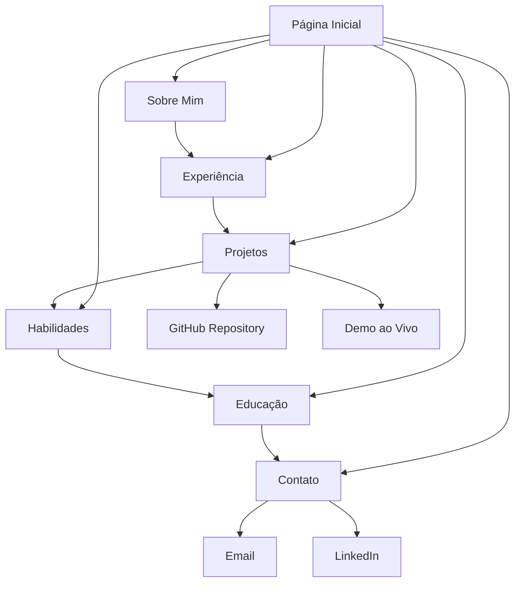

# Documentação Técnica - Modernização do Currículo Online
## Matheus Zeitune - Desenvolvedor Full Stack

## 1. Visão Geral do Projeto

Este documento define os requisitos para modernizar e aprimorar o site de currículo online do desenvolvedor Matheus Zeitune. O objetivo é criar uma experiência profissional, moderna e interativa que destaque suas competências técnicas como desenvolvedor Full Stack especializado em .NET e React.

**Problemas identificados no site atual:**
- Design datado que não reflete as tendências modernas de UI/UX
- Falta de interatividade e animações
- Ausência de funcionalidades específicas para desenvolvedores
- Layout não otimizado para diferentes dispositivos
- Informações técnicas pouco destacadas

## 2. Funcionalidades Principais

### 2.1 Papéis de Usuário
| Papel | Método de Acesso | Permissões Principais |
|-------|------------------|----------------------|
| Visitante | Acesso direto ao site | Visualizar currículo, baixar PDF, entrar em contato |
| Recrutador | Acesso direto ao site | Visualizar projetos, acessar repositórios, contato direto |

### 2.2 Módulos Funcionais

O site modernizado consistirá nas seguintes páginas principais:

1. **Página Inicial**: hero section interativo, navegação fluida, apresentação pessoal dinâmica
2. **Sobre Mim**: biografia expandida, timeline de carreira, valores profissionais
3. **Experiência Profissional**: timeline interativo, detalhes expandíveis, tecnologias utilizadas
4. **Projetos**: portfólio de projetos com links para GitHub, demos ao vivo, stack tecnológico
5. **Habilidades Técnicas**: visualização interativa de skills, níveis de proficiência, certificações
6. **Educação**: formação acadêmica, cursos, certificações relevantes
7. **Contato**: formulário funcional, links para redes sociais, disponibilidade para trabalho

### 2.3 Detalhes das Páginas

| Nome da Página | Nome do Módulo | Descrição da Funcionalidade |
|----------------|----------------|-----------------------------|
| Página Inicial | Hero Section | Apresentação dinâmica com animações, call-to-action para download do CV, navegação suave |
| Página Inicial | Navegação | Menu responsivo com indicadores de seção ativa, scroll suave entre seções |
| Sobre Mim | Timeline Profissional | Linha do tempo interativa mostrando evolução da carreira com marcos importantes |
| Experiência | Cards Interativos | Cards expansíveis com detalhes de cada posição, tecnologias usadas, conquistas |
| Projetos | Portfólio | Grid responsivo de projetos com filtros por tecnologia, links para GitHub e demos |
| Habilidades | Visualização de Skills | Gráficos interativos mostrando proficiência em diferentes tecnologias |
| Habilidades | Certificações | Seção dedicada para certificações e cursos relevantes |
| Contato | Formulário | Formulário funcional com validação, integração com email |
| Contato | Redes Sociais | Links diretos para GitHub, LinkedIn, outros perfis profissionais |

## 3. Fluxo Principal de Navegação

O usuário navega pelo site de forma linear ou através do menu de navegação:

1. **Visitante acessa o site** → Visualiza hero section com apresentação
2. **Explora seções** → Navega através do menu ou scroll para conhecer o profissional
3. **Visualiza projetos** → Acessa portfólio e repositórios no GitHub
4. **Entra em contato** → Utiliza formulário ou links diretos para contato

## 4. Design e Interface do Usuário

### 4.1 Estilo de Design

**Paleta de Cores:**
- Primária: #2c3e50 (Azul escuro profissional)
- Secundária: #3498db (Azul moderno)
- Accent: #e74c3c (Vermelho para CTAs)
- Neutros: #f8f9fa (Fundo claro), #343a40 (Texto escuro)
- Gradientes: Linear gradients para hero sections e cards

**Tipografia:**
- Fonte principal: 'Inter' ou 'Roboto' (moderna e legível)
- Tamanhos: 16px base, 24px headings, 14px small text
- Peso: 300 (light), 400 (regular), 600 (semibold), 700 (bold)

**Estilo de Componentes:**
- Botões: Rounded corners (8px), hover effects, smooth transitions
- Cards: Subtle shadows, hover animations, clean borders
- Layout: Grid system responsivo, espaçamento consistente
- Ícones: Feather Icons ou Heroicons para consistência
- Animações: Smooth transitions, fade-ins, parallax effects

### 4.2 Visão Geral do Design das Páginas

| Nome da Página | Nome do Módulo | Elementos de UI |
|----------------|----------------|----------------|
| Página Inicial | Hero Section | Background gradient, foto profissional, texto animado, CTA buttons, scroll indicator |
| Página Inicial | Navegação | Fixed header, logo, menu responsivo, progress indicator |
| Experiência | Timeline | Vertical timeline com cards, ícones de empresas, badges de tecnologias |
| Projetos | Grid de Projetos | Cards com imagens, overlay com informações, filtros por tecnologia |
| Habilidades | Skills Chart | Progress bars animados, ícones de tecnologias, categorização por área |
| Contato | Formulário | Campos estilizados, validação visual, botão de envio animado |

### 4.3 Responsividade

O site será desenvolvido com abordagem mobile-first, garantindo:
- **Desktop (1200px+)**: Layout completo com sidebar, múltiplas colunas
- **Tablet (768px-1199px)**: Layout adaptado, navegação colapsável
- **Mobile (320px-767px)**: Layout em coluna única, menu hambúrguer, touch-friendly
- **Otimizações**: Imagens responsivas, texto legível, botões adequados para touch

## 5. Funcionalidades Técnicas Específicas

### 5.1 Seção de Projetos Interativa
- **Filtros por tecnologia**: JavaScript, React, .NET, etc.
- **Links diretos**: GitHub repositories, demos ao vivo
- **Detalhes técnicos**: Stack utilizado, desafios superados, resultados

### 5.2 Visualização de Habilidades
- **Gráficos animados**: Progress bars para níveis de proficiência
- **Categorização**: Frontend, Backend, DevOps, Databases
- **Certificações**: Badges e links para validação

### 5.3 Timeline de Experiência
- **Navegação temporal**: Filtros por período ou empresa
- **Detalhes expandíveis**: Responsabilidades, tecnologias, conquistas
- **Integração com LinkedIn**: Links diretos para validação

### 5.4 Otimizações de Performance
- **Lazy loading**: Imagens e componentes carregados sob demanda
- **Minificação**: CSS e JavaScript otimizados
- **CDN**: Uso de CDNs para bibliotecas e assets
- **Caching**: Estratégias de cache para melhor performance

### 5.5 SEO e Acessibilidade
- **Meta tags**: Otimizadas para busca e redes sociais
- **Schema markup**: Dados estruturados para melhor indexação
- **Acessibilidade**: ARIA labels, contraste adequado, navegação por teclado
- **Performance**: Core Web Vitals otimizados

## 6. Tecnologias e Ferramentas Destacadas

### 6.1 Stack Técnico do Site
- **Frontend**: HTML5, CSS3, JavaScript ES6+, Bootstrap 5
- **Animações**: AOS (Animate On Scroll), CSS Animations
- **Ícones**: Feather Icons, Font Awesome
- **Formulários**: EmailJS ou Netlify Forms
- **Deploy**: GitHub Pages, Netlify ou Vercel

### 6.2 Habilidades Técnicas a Destacar

**Linguagens de Programação:**
- C# (.NET 6/8, ASP.NET Core, Entity Framework)
- JavaScript/TypeScript (ES6+, Node.js)
- SQL (SQL Server, PostgreSQL)
- HTML5/CSS3 (Responsive Design, Flexbox, Grid)

**Frameworks e Bibliotecas:**
- Frontend: React, Angular, Next.js
- Backend: ASP.NET Core, Express.js
- ORM: Entity Framework Core, TypeORM
- Testing: xUnit, Jest, Cypress

**DevOps e Ferramentas:**
- Containerização: Docker, Kubernetes
- CI/CD: Azure DevOps, GitHub Actions
- Cloud: Azure, AWS
- Monitoramento: Prometheus, Grafana, Application Insights
- Versionamento: Git, GitHub, Azure Repos

**Bancos de Dados:**
- Relacionais: SQL Server, PostgreSQL
- NoSQL: MongoDB, Redis
- Search: Elasticsearch

### 6.3 Projetos em Destaque

1. **ERP FFManager (Flamengo)**
   - Tecnologias: .NET 8, React, RabbitMQ, Redis
   - Arquitetura: Microsserviços, Clean Architecture
   - Funcionalidades: Gestão esportiva, API Gateway (Ocelot)

2. **Sistema MPSC (Ministério Público SC)**
   - Tecnologias: .NET 8, Next.js, SQL Server
   - Características: SSR/SSG, alta performance
   - Segurança: Dados sensíveis, integração governamental

3. **Modernização MJSP (Ministério da Justiça)**
   - Migração: ASP.NET MVC 5 → .NET 6
   - Escalabilidade: 50k+ usuários simultâneos
   - DevOps: Docker, Azure Kubernetes Service

## 7. Implementação e Melhorias

### 7.1 Fases de Desenvolvimento

**Fase 1 - Estrutura Base (Semana 1)**
- Reestruturação do HTML semântico
- Implementação do sistema de grid responsivo
- Configuração da paleta de cores e tipografia

**Fase 2 - Componentes Interativos (Semana 2)**
- Desenvolvimento da timeline de experiência
- Criação do portfólio de projetos
- Implementação das animações e transições

**Fase 3 - Funcionalidades Avançadas (Semana 3)**
- Formulário de contato funcional
- Otimizações de performance
- Testes de responsividade e acessibilidade

**Fase 4 - Deploy e Otimização (Semana 4)**
- Configuração de SEO
- Deploy em produção
- Monitoramento e ajustes finais

### 7.2 Métricas de Sucesso

- **Performance**: Lighthouse Score > 90
- **Acessibilidade**: WCAG 2.1 AA compliance
- **SEO**: Meta tags otimizadas, schema markup
- **Responsividade**: Funcional em todos os dispositivos
- **Engajamento**: Tempo de permanência > 2 minutos

Esta documentação serve como guia completo para a modernização do currículo online, garantindo que todas as melhorias sejam implementadas de forma sistemática e profissional.