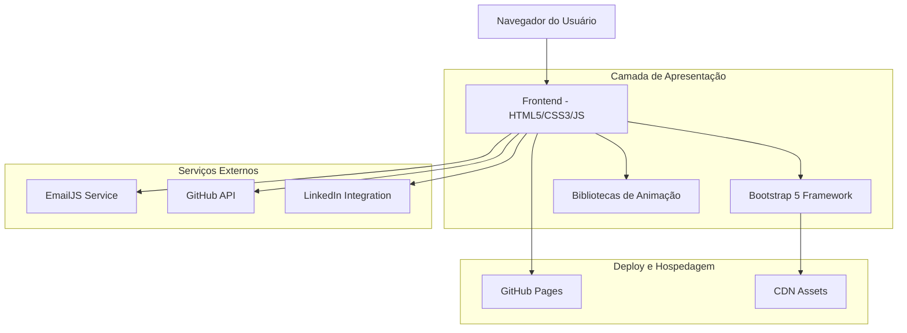

# Arquitetura Técnica - Modernização do Currículo Online
## Matheus Zeitune - Desenvolvedor Full Stack

## 1. Arquitetura de Design



## 2. Descrição das Tecnologias

- **Frontend**: HTML5 + CSS3 + JavaScript ES6+ + Bootstrap 5
- **Animações**: AOS (Animate On Scroll), CSS Animations, GSAP (opcional)
- **Ícones**: Feather Icons, Font Awesome
- **Formulários**: EmailJS para envio de emails
- **Deploy**: GitHub Pages
- **CDN**: jsDelivr, Google Fonts

## 3. Definições de Rotas

| Rota | Propósito |
|------|----------|
| / | Página principal com todas as seções (SPA) |
| /#sobre | Seção sobre mim com âncora |
| /#experiencia | Timeline de experiência profissional |
| /#projetos | Portfólio de projetos |
| /#habilidades | Visualização de skills técnicas |
| /#educacao | Formação acadêmica e certificações |
| /#contato | Formulário de contato e redes sociais |

## 4. Estrutura de Arquivos

```
d:\TI\git\v2\mzet97.github.io\
├── index.html                 # Página principal
├── assets/
│   ├── css/
│   │   ├── bootstrap.min.css  # Framework CSS
│   │   ├── style.css          # Estilos customizados
│   │   └── animations.css     # Animações específicas
│   ├── js/
│   │   ├── bootstrap.min.js   # Framework JS
│   │   ├── aos.js            # Animate On Scroll
│   │   ├── emailjs.min.js    # Serviço de email
│   │   └── main.js           # Scripts customizados
│   ├── img/
│   │   ├── profile/          # Fotos profissionais
│   │   ├── projects/         # Screenshots de projetos
│   │   ├── companies/        # Logos das empresas
│   │   └── technologies/     # Ícones de tecnologias
│   └── fonts/               # Fontes customizadas
├── docs/
│   └── CV_Matheus_Zeitune.pdf # Currículo em PDF
└── README.md               # Documentação do projeto
```

## 5. Componentes e Módulos

### 5.1 Componentes de Interface

**Header/Navegação**
```html
<nav class="navbar navbar-expand-lg navbar-dark fixed-top">
  <div class="container">
    <a class="navbar-brand" href="#">Matheus Zeitune</a>
    <div class="navbar-nav">
      <a class="nav-link" href="#sobre">Sobre</a>
      <a class="nav-link" href="#experiencia">Experiência</a>
      <a class="nav-link" href="#projetos">Projetos</a>
      <a class="nav-link" href="#habilidades">Habilidades</a>
      <a class="nav-link" href="#contato">Contato</a>
    </div>
  </div>
</nav>
```

**Hero Section**
```html
<section id="hero" class="hero-section">
  <div class="container">
    <div class="hero-content" data-aos="fade-up">
      <h1 class="hero-title">Matheus Zeitune</h1>
      <p class="hero-subtitle">Desenvolvedor Full Stack .NET/React</p>
      <div class="hero-buttons">
        <a href="#contato" class="btn btn-primary">Entre em Contato</a>
        <a href="docs/CV_Matheus_Zeitune.pdf" class="btn btn-outline-light">Download CV</a>
      </div>
    </div>
  </div>
</section>
```

**Timeline de Experiência**
```html
<section id="experiencia" class="experience-section">
  <div class="container">
    <h2 class="section-title" data-aos="fade-up">Experiência Profissional</h2>
    <div class="timeline">
      <div class="timeline-item" data-aos="fade-right">
        <div class="timeline-marker"></div>
        <div class="timeline-content">
          <h3>Desenvolvedor Full Stack .NET/React Pleno</h3>
          <h4>Clube de Regatas do Flamengo</h4>
          <span class="period">05/2024 - presente</span>
          <p>Desenvolvimento do ERP FFManager...</p>
          <div class="tech-stack">
            <span class="tech-badge">.NET 8</span>
            <span class="tech-badge">React</span>
            <span class="tech-badge">RabbitMQ</span>
          </div>
        </div>
      </div>
    </div>
  </div>
</section>
```

### 5.2 Módulos JavaScript

**main.js - Funcionalidades Principais**
```javascript
// Inicialização das animações
AOS.init({
  duration: 1000,
  once: true,
  offset: 100
});

// Smooth scrolling para navegação
document.querySelectorAll('a[href^="#"]').forEach(anchor => {
  anchor.addEventListener('click', function (e) {
    e.preventDefault();
    const target = document.querySelector(this.getAttribute('href'));
    target.scrollIntoView({
      behavior: 'smooth',
      block: 'start'
    });
  });
});

// Indicador de progresso de scroll
window.addEventListener('scroll', () => {
  const scrolled = (window.scrollY / (document.documentElement.scrollHeight - window.innerHeight)) * 100;
  document.querySelector('.scroll-progress').style.width = scrolled + '%';
});

// Formulário de contato
function sendEmail(event) {
  event.preventDefault();
  
  const formData = {
    name: document.getElementById('name').value,
    email: document.getElementById('email').value,
    message: document.getElementById('message').value
  };
  
  emailjs.send('service_id', 'template_id', formData)
    .then(() => {
      showNotification('Mensagem enviada com sucesso!', 'success');
      document.getElementById('contact-form').reset();
    })
    .catch(() => {
      showNotification('Erro ao enviar mensagem. Tente novamente.', 'error');
    });
}
```

## 6. Estilos CSS Customizados

### 6.1 Variáveis CSS

```css
:root {
  /* Cores */
  --primary-color: #2c3e50;
  --secondary-color: #3498db;
  --accent-color: #e74c3c;
  --success-color: #27ae60;
  --warning-color: #f39c12;
  --light-bg: #f8f9fa;
  --dark-bg: #343a40;
  --white: #ffffff;
  --text-dark: #2c3e50;
  --text-light: #6c757d;
  
  /* Tipografia */
  --font-primary: 'Inter', -apple-system, BlinkMacSystemFont, 'Segoe UI', sans-serif;
  --font-size-base: 1rem;
  --font-size-lg: 1.125rem;
  --font-size-xl: 1.25rem;
  --font-size-2xl: 1.5rem;
  --font-size-3xl: 2rem;
  
  /* Espaçamentos */
  --spacing-xs: 0.5rem;
  --spacing-sm: 1rem;
  --spacing-md: 1.5rem;
  --spacing-lg: 2rem;
  --spacing-xl: 3rem;
  
  /* Sombras */
  --shadow-sm: 0 2px 4px rgba(0,0,0,0.1);
  --shadow-md: 0 4px 8px rgba(0,0,0,0.15);
  --shadow-lg: 0 8px 16px rgba(0,0,0,0.2);
  
  /* Transições */
  --transition-fast: 0.2s ease;
  --transition-normal: 0.3s ease;
  --transition-slow: 0.5s ease;
}
```

### 6.2 Componentes Estilizados

```css
/* Hero Section */
.hero-section {
  min-height: 100vh;
  background: linear-gradient(135deg, var(--primary-color), var(--secondary-color));
  display: flex;
  align-items: center;
  color: var(--white);
  position: relative;
  overflow: hidden;
}

.hero-section::before {
  content: '';
  position: absolute;
  top: 0;
  left: 0;
  right: 0;
  bottom: 0;
  background: url('data:image/svg+xml,<svg xmlns="http://www.w3.org/2000/svg" viewBox="0 0 100 100"><defs><pattern id="grain" width="100" height="100" patternUnits="userSpaceOnUse"><circle cx="50" cy="50" r="1" fill="%23ffffff" opacity="0.1"/></pattern></defs><rect width="100" height="100" fill="url(%23grain)"/></svg>') repeat;
  pointer-events: none;
}

/* Timeline */
.timeline {
  position: relative;
  padding: var(--spacing-lg) 0;
}

.timeline::before {
  content: '';
  position: absolute;
  left: 50%;
  top: 0;
  bottom: 0;
  width: 2px;
  background: var(--secondary-color);
  transform: translateX(-50%);
}

.timeline-item {
  position: relative;
  margin-bottom: var(--spacing-xl);
  width: 50%;
}

.timeline-item:nth-child(odd) {
  left: 0;
  padding-right: var(--spacing-lg);
  text-align: right;
}

.timeline-item:nth-child(even) {
  left: 50%;
  padding-left: var(--spacing-lg);
}

.timeline-marker {
  position: absolute;
  top: 0;
  width: 16px;
  height: 16px;
  background: var(--secondary-color);
  border: 4px solid var(--white);
  border-radius: 50%;
  box-shadow: var(--shadow-md);
}

.timeline-item:nth-child(odd) .timeline-marker {
  right: -8px;
}

.timeline-item:nth-child(even) .timeline-marker {
  left: -8px;
}

/* Cards de Projeto */
.project-card {
  background: var(--white);
  border-radius: 12px;
  overflow: hidden;
  box-shadow: var(--shadow-sm);
  transition: all var(--transition-normal);
  height: 100%;
}

.project-card:hover {
  transform: translateY(-8px);
  box-shadow: var(--shadow-lg);
}

.project-card img {
  width: 100%;
  height: 200px;
  object-fit: cover;
  transition: transform var(--transition-normal);
}

.project-card:hover img {
  transform: scale(1.05);
}

/* Skills Progress */
.skill-item {
  margin-bottom: var(--spacing-md);
}

.skill-name {
  display: flex;
  justify-content: space-between;
  margin-bottom: var(--spacing-xs);
  font-weight: 600;
}

.skill-bar {
  height: 8px;
  background: #e9ecef;
  border-radius: 4px;
  overflow: hidden;
}

.skill-progress {
  height: 100%;
  background: linear-gradient(90deg, var(--secondary-color), var(--primary-color));
  border-radius: 4px;
  transition: width 1s ease-in-out;
  width: 0;
}

.skill-progress.animate {
  animation: fillProgress 1.5s ease-in-out forwards;
}

@keyframes fillProgress {
  to {
    width: var(--progress-width);
  }
}
```

## 7. Integração com Serviços Externos

### 7.1 EmailJS Configuration

```javascript
// Configuração do EmailJS
(function() {
  emailjs.init('YOUR_PUBLIC_KEY');
})();

const emailConfig = {
  serviceID: 'service_portfolio',
  templateID: 'template_contact',
  publicKey: 'YOUR_PUBLIC_KEY'
};

function initEmailJS() {
  emailjs.init(emailConfig.publicKey);
}
```

### 7.2 GitHub API Integration

```javascript
// Buscar repositórios do GitHub
async function fetchGitHubRepos() {
  try {
    const response = await fetch('https://api.github.com/users/mzet97/repos?sort=updated&per_page=6');
    const repos = await response.json();
    
    const projectsContainer = document.getElementById('github-projects');
    
    repos.forEach(repo => {
      if (!repo.fork && repo.description) {
        const projectCard = createProjectCard(repo);
        projectsContainer.appendChild(projectCard);
      }
    });
  } catch (error) {
    console.error('Erro ao buscar repositórios:', error);
  }
}

function createProjectCard(repo) {
  const card = document.createElement('div');
  card.className = 'col-md-6 col-lg-4 mb-4';
  card.innerHTML = `
    <div class="project-card" data-aos="fade-up">
      <div class="project-image">
        
      </div>
      <div class="project-content p-4">
        <h5>${repo.name}</h5>
        <p class="text-muted">${repo.description}</p>
        <div class="project-tech mb-3">
          <span class="tech-badge">${repo.language || 'JavaScript'}</span>
        </div>
        <div class="project-links">
          <a href="${repo.html_url}" target="_blank" class="btn btn-outline-primary btn-sm">
            <i class="fab fa-github"></i> Código
          </a>
          ${repo.homepage ? `<a href="${repo.homepage}" target="_blank" class="btn btn-primary btn-sm">Demo</a>` : ''}
        </div>
      </div>
    </div>
  `;
  return card;
}
```

## 8. Performance e Otimização

### 8.1 Lazy Loading

```javascript
// Lazy loading para imagens
const imageObserver = new IntersectionObserver((entries, observer) => {
  entries.forEach(entry => {
    if (entry.isIntersecting) {
      const img = entry.target;
      img.src = img.dataset.src;
      img.classList.remove('lazy');
      observer.unobserve(img);
    }
  });
});

document.querySelectorAll('img[data-src]').forEach(img => {
  imageObserver.observe(img);
});
```

### 8.2 Minificação e Compressão

```html
<!-- CSS minificado -->
<link rel="stylesheet" href="assets/css/style.min.css">

<!-- JavaScript minificado -->
<script src="assets/js/main.min.js"></script>

<!-- Preload de recursos críticos -->
<link rel="preload" href="assets/fonts/inter-var.woff2" as="font" type="font/woff2" crossorigin>
<link rel="preload" href="assets/css/style.min.css" as="style">
```

## 9. SEO e Meta Tags

```html
<!DOCTYPE html>
<html lang="pt-BR">
<head>
  <meta charset="UTF-8">
  <meta name="viewport" content="width=device-width, initial-scale=1.0">
  
  <!-- SEO Meta Tags -->
  <title>Matheus Zeitune - Desenvolvedor Full Stack .NET/React | Portfólio</title>
  <meta name="description" content="Desenvolvedor Full Stack especializado em .NET e React com 5+ anos de experiência. Confira meu portfólio e projetos.">
  <meta name="keywords" content="desenvolvedor, full stack, .NET, React, C#, JavaScript, TypeScript, Azure">
  <meta name="author" content="Matheus Zeitune">
  
  <!-- Open Graph -->
  <meta property="og:title" content="Matheus Zeitune - Desenvolvedor Full Stack">
  <meta property="og:description" content="Portfólio profissional de Matheus Zeitune, desenvolvedor Full Stack especializado em .NET e React.">
  <meta property="og:image" content="https://mzet97.github.io/assets/img/og-image.jpg">
  <meta property="og:url" content="https://mzet97.github.io">
  <meta property="og:type" content="website">
  
  <!-- Twitter Card -->
  <meta name="twitter:card" content="summary_large_image">
  <meta name="twitter:title" content="Matheus Zeitune - Desenvolvedor Full Stack">
  <meta name="twitter:description" content="Portfólio profissional de Matheus Zeitune">
  <meta name="twitter:image" content="https://mzet97.github.io/assets/img/twitter-card.jpg">
  
  <!-- Structured Data -->
  <script type="application/ld+json">
  {
    "@context": "https://schema.org",
    "@type": "Person",
    "name": "Matheus Zeitune",
    "jobTitle": "Desenvolvedor Full Stack",
    "url": "https://mzet97.github.io",
    "sameAs": [
      "https://linkedin.com/in/matheus-zeitune",
      "https://github.com/mzet97"
    ],
    "knowsAbout": [".NET", "React", "C#", "JavaScript", "TypeScript", "Azure", "DevOps"]
  }
  </script>
</head>
```

## 10. Deploy e Configuração

### 10.1 GitHub Pages Configuration

```yaml
# .github/workflows/deploy.yml
name: Deploy to GitHub Pages

on:
  push:
    branches: [ main ]
  pull_request:
    branches: [ main ]

jobs:
  deploy:
    runs-on: ubuntu-latest
    
    steps:
    - uses: actions/checkout@v3
    
    - name: Setup Node.js
      uses: actions/setup-node@v3
      with:
        node-version: '18'
        
    - name: Install dependencies
      run: npm install
      
    - name: Build project
      run: npm run build
      
    - name: Deploy to GitHub Pages
      uses: peaceiris/actions-gh-pages@v3
      with:
        github_token: ${{ secrets.GITHUB_TOKEN }}
        publish_dir: ./dist
```

### 10.2 Package.json

```json
{
  "name": "matheus-zeitune-portfolio",
  "version": "2.0.0",
  "description": "Portfólio profissional de Matheus Zeitune",
  "scripts": {
    "build": "npm run build:css && npm run build:js",
    "build:css": "postcss assets/css/style.css -o assets/css/style.min.css --use autoprefixer cssnano",
    "build:js": "terser assets/js/main.js -o assets/js/main.min.js --compress --mangle",
    "watch": "npm run watch:css & npm run watch:js",
    "watch:css": "postcss assets/css/style.css -o assets/css/style.min.css --use autoprefixer --watch",
    "serve": "live-server --port=3000"
  },
  "devDependencies": {
    "autoprefixer": "^10.4.16",
    "cssnano": "^6.0.1",
    "live-server": "^1.2.2",
    "postcss": "^8.4.31",
    "postcss-cli": "^10.1.0",
    "terser": "^5.24.0"
  }
}
```

Esta arquitetura técnica fornece uma base sólida para implementar todas as melhorias propostas no currículo online, garantindo performance, acessibilidade e uma experiência de usuário moderna e profissional.